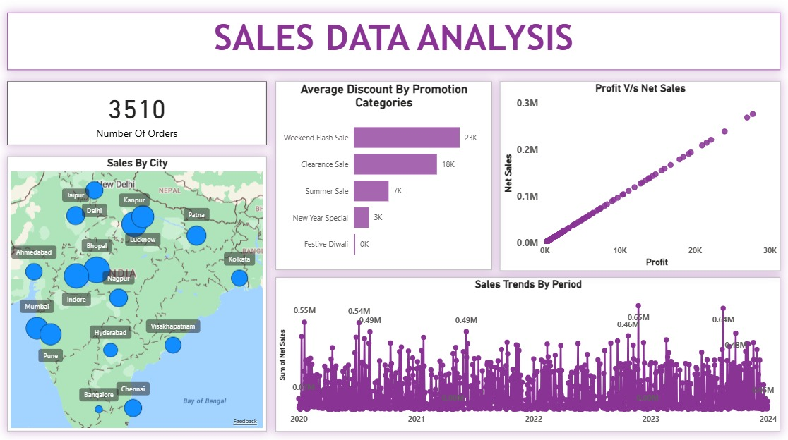

# Power BI Sales Insights for an E-commerce Company

## Project Overview

This project features a comprehensive sales analysis dashboard built with Power BI. The goal is to provide actionable insights into the sales performance of an e-commerce company, helping stakeholders make data-driven decisions to optimize marketing strategies, manage inventory, and drive revenue growth.

---

## Dashboard Preview

Here are some key views from the dashboard:

### 1. Overview Dashboard
A high-level view of key performance indicators (KPIs), geographical sales distribution, and trend analysis.

### 2. Top 5 Insights
Highlights the most critical findings, such as top-performing products, most valuable customers, and key sales trends.

### 3. Comparison Analysis
Provides a comparative view of sales metrics across different time periods, regions, or product categories.

**Method 1:**

**Method 2:**

### 4. Detailed Table Visual
A granular, tabular view of the sales data for in-depth exploration.

---

## Key Insights & Findings

*   **Top Revenue Generating Products:** [Mention 1-2 key findings here, e.g., "Product A and Product B contribute to 40% of total revenue."]
*   **Peak Sales Periods:** [Mention your finding, e.g., "Sales peak during the holiday season in Q4, with a significant spike in November."]
*   **Highest Performing Regions:** [Mention your finding, e.g., "The West region shows the highest sales volume, while the South region has the fastest growth rate."]
*   **Customer Behavior:** [Mention your finding, e.g., "Repeat customers have a 30% higher average order value than new customers."]

---

## Tools & Technologies Used

*   **Power BI:** For data modeling, DAX calculations, and interactive dashboard creation.
*   **Data Source:** [Mention the source, e.g., "SQL Database", "Excel/CSV files"].
*   **Power Query:** For data cleaning, transformation, and ETL processes.

---

## Project Files

*   `Project 1.pbix`: The main Power BI report file containing the data model, queries, and all dashboard visuals.
*   **Image Files (`.jpg`):** Screenshots of the different dashboard pages for a quick preview.

---

## How to Use

1.  Download the `Project 1.pbix` file.
2.  Open it using **Power BI Desktop**.
3.  Interact with the slicers, filters, and visuals to explore the sales data.

Repo By: Manan Sapaloke
LinkedIn: http://www.linkedin.com/in/manansapaloke
Github: https://github.com/MananSapaloke
